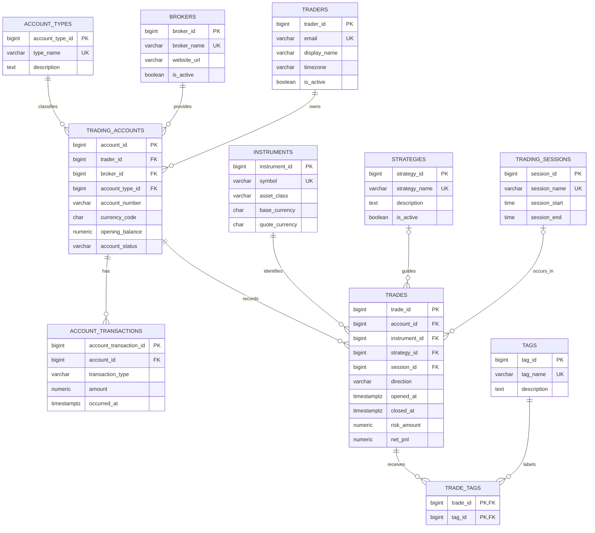

# Entity Relationship Design

## Why these entities exist

| Entity | Purpose |
|---|---|
| `traders` | Owns journal data and provides an identity boundary for reporting. |
| `brokers` | Reusable broker reference data; a broker serves many accounts. |
| `account_types` | Avoids repeating account-type labels on accounts. |
| `trading_accounts` | Records an account's owner, broker, currency, opening balance, and lifecycle state. |
| `instruments` | Canonical catalogue of tradeable symbols and their asset class. |
| `strategies` | Captures the reusable trading methodology used for a trade. |
| `trading_sessions` | Standardises the session used for performance comparisons. |
| `trades` | The central fact: one completed/open trading position and its financial result. |
| `account_transactions` | Models deposits, withdrawals, and adjustments separately from trading P&L. |
| `tags` / `trade_tags` | Implements an optional many-to-many classification system for review. |

## Relationships

- One trader has many trading accounts; an account belongs to one trader.
- One broker and one account type can each describe many trading accounts.
- One account has many trades and account transactions.
- One instrument, strategy, or session can be associated with many trades; a trade has one instrument and may have one strategy/session.
- A trade may have many tags; a tag may be applied to many trades through `trade_tags`.

## ERD

## Normalization

**First Normal Form (1NF):** every column holds a single atomic value. Tags are not stored as a comma-separated list; `trade_tags` represents each applied tag as a row. There are no repeating instrument or strategy columns.

**Second Normal Form (2NF):** non-key facts depend on the whole key. `trade_tags` has the composite key `(trade_id, tag_id)` and no attributes that depend on only one part. Trade facts depend on `trade_id`, while account facts depend on `account_id`.

**Third Normal Form (3NF):** non-key attributes do not transitively determine other non-key attributes. Broker details live in `brokers`, symbol metadata lives in `instruments`, and strategy/session descriptions live in their own tables. `net_pnl` is a generated value from columns in the same trade row, and account balance is calculated in a query rather than stored redundantly.

## Integrity controls

- Positive prices, volume, risk, opening balances, and transaction amounts are enforced with `CHECK` constraints.
- `closed` trades must contain exit details and a close time after their open time; `open` trades cannot contain a close time or exit price.
- `net_pnl` is generated as `gross_pnl - commission + swap`, removing manual arithmetic errors.
- Account number is unique within a broker, and broker order ID is unique within an account when supplied.
- Foreign keys prevent orphaned trades, transactions, and tags.
- The trigger in `constraints.sql` rejects trade writes for inactive accounts or inactive traders.
